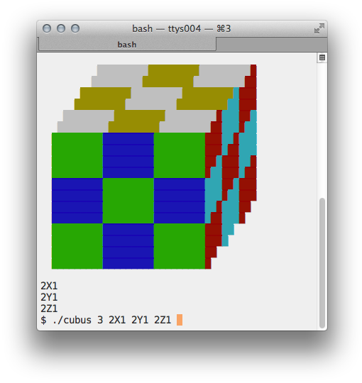

# RustyCube

A Rubik's Cube for your terminal in Rust.





- Download Rust from [rust-lang.org](http://www.rust-lang.org).  The source compiles with Rust version 1.54.0 or later.
- Compile the source:  `rustc -C opt-level=3 --color auto cubus.rs`
- Enjoy!  The example in the image above is: `./cubus 3 2X1 2Y1 2Z1`
- Explore!  If you give a negative edge length, `cubus` finds all move sequences that have the same result as your input and are not longer than your input.  Beware, however, that combinatorial explosion makes your RAM evaporate quickly.  A sequence of 6 moves on a 3x3x3 cube will already strain your patience and your machine.  Consider the above example, having 6 moves:

```
$ time ./cubus -3 2X1 2Y1 2Z1
[...]
18 sequences from 22707269 exploratory moves:
X1X1Y1Y1Z1Z1	X1X1Z1Z1Y1Y1	X1Y1Y1Z1Z1X1	X1Z1Z1Y1Y1X1
x1Y1Y1Z1Z1x1	x1Z1Z1Y1Y1x1	Y1X1X1Z1Z1Y1	Y1Y1X1X1Z1Z1
Y1Y1Z1Z1X1X1	Y1Z1Z1x1x1Y1	y1X1X1Z1Z1y1	y1Z1Z1x1x1y1
Z1X1X1Y1Y1Z1	Z1Y1Y1x1x1Z1	Z1Z1X1X1Y1Y1	Z1Z1Y1Y1X1X1
z1X1X1Y1Y1z1	z1Y1Y1x1x1z1

real	0m18.907s
user	0m18.492s
sys	0m0.406s

```

The above was compiled with Rust 1.60.0 and run on macOS 12.4 with a 3.8 GHz Intel Core i7 CPU.
